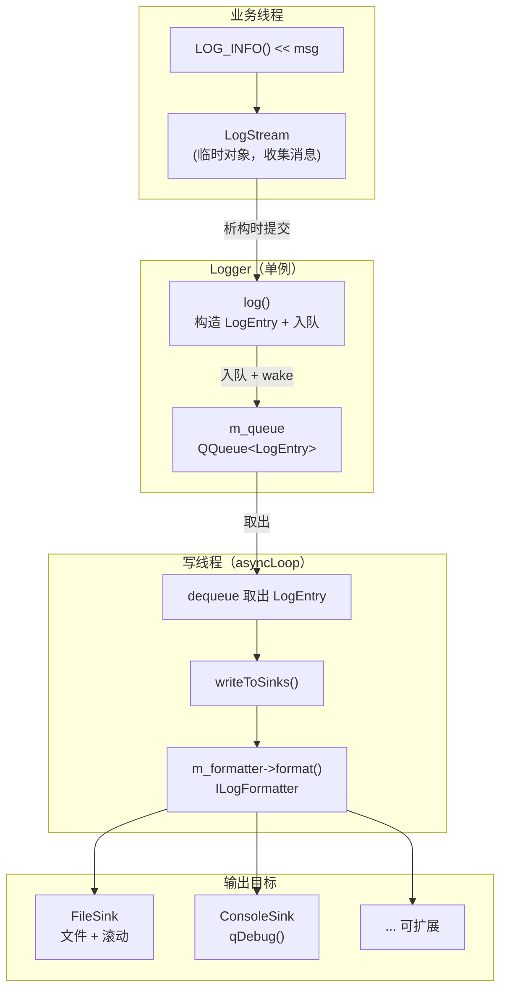
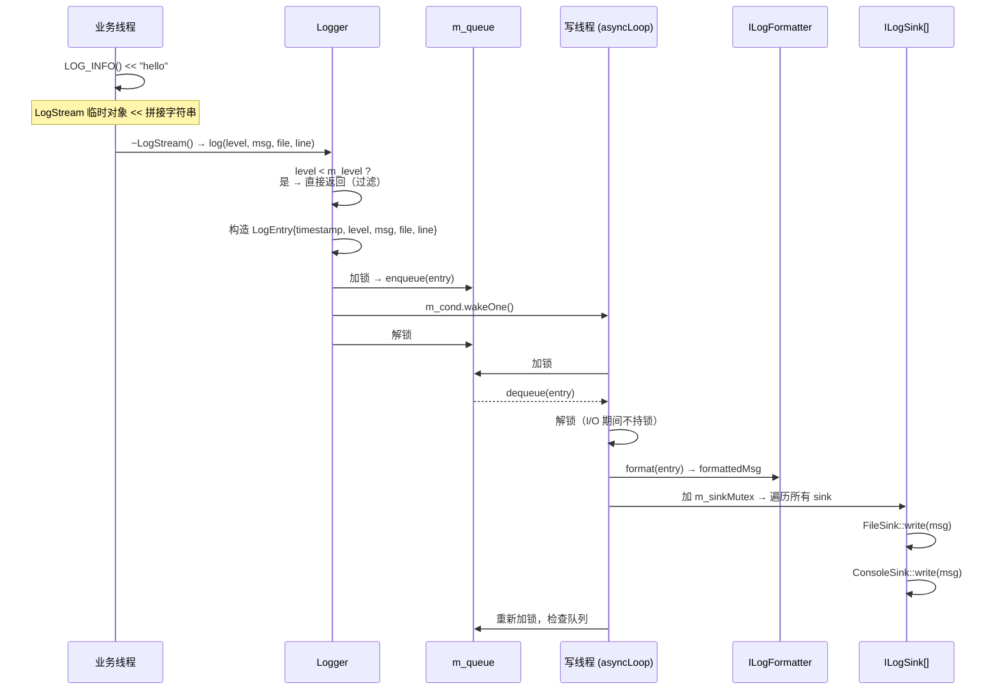
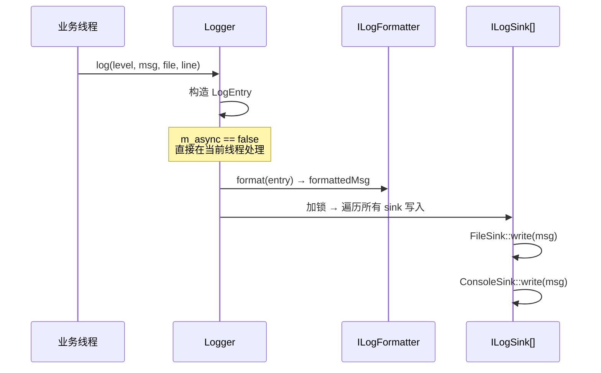
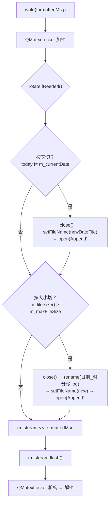
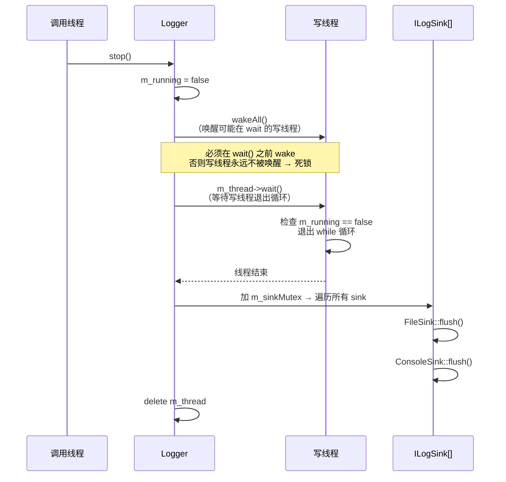
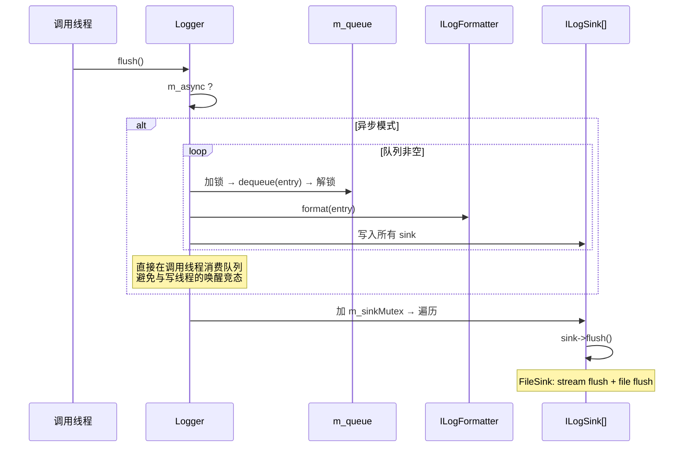

# 日志系统流程图

## 1. 整体架构

## 2. 主流程：异步日志写入

## 3. 同步模式流程

## 4. FileSink 内部流程

## 5. 关闭流程 (stop)

## 6. flush 流程

## 7. 关键设计决策

| 决策 | 原因 |
|------|------|
| 时间戳在 log() 中捕获 | 日志时间反映"事件发生时刻"而非"写入时刻" |
| LogStream 析构提交 | RAII 保证即使抛异常也能提交日志 |
| 写线程 dequeue 后立即解锁 | I/O 不持锁，业务线程可以继续入队 |
| stop() 先 wakeAll 再 wait | 防止写线程在 m_cond.wait() 中永久阻塞导致死锁 |
| flush() 直接消费队列 | 避免与写线程的 cond wait/wake 竞态 |
| FileSink 独立锁 | write() 和 flush() 可能并发（flush 从外部调用） |
| 格式化发生在写线程 | 减少业务线程开销，且便于将来按 sink 定制格式 |
